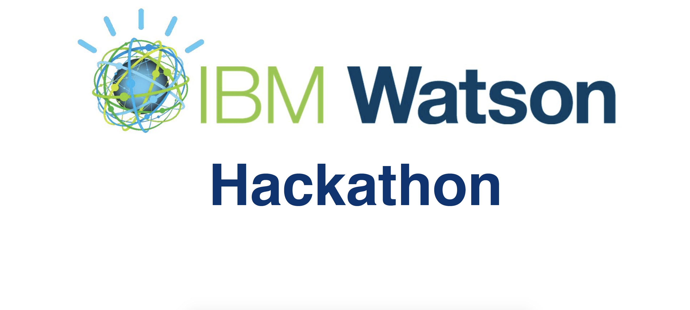

# IBM Hackathon 2018

On 23 and 24 November 2018, a coding hackathon was organized in the headquarter of IBM Brussels. Each team has to solve a real life problem of an IBM client by making use of IBM Cloud services. IT-professors of Belgian universities and university colleges were invited to send teams of 4 students with programming experience. The objective was to get teams of different university colleges and different faculties departments of universities.

## The SABAM case - What’s the next big thing?

Sabam is always on the lookout for emerging talent. Emerging bands are not always aware of their rights and the money they can rightfully earn for public performances. As part of Sabam’s mission we want to reach out to these bands and inform them about authorsrights, their rights, the in- and outs of publishing deals and the general “what’s in it for you”. Authors that are still under radar of the mainstream press but are about to boom are our main target.

Our mission : What Belgian, French or Dutch musical authors/bands are booming under the radar? What’s the chatter about, where’s the buzz? What’s the next big thing?

## The problem

Every day, the account manager of SABAM looks for new talents to affiliate in Belgium, France and Netherlands. To do so, he uses several online platforms like Spotify, YouTube or Facebook to spot them. The problem is that this task is quite time-consuming, it's not a funny thing to do and finally, when we talk about a new artist on a social media, it's often already too late, he has probably been contacted by another company.

So concretely, what does SABAM wants ? It wants to detect new potential talents before anyone else does.

## Our solution

Our solution consists in using some machine learning algorithms that would use the exact same plateforms that the SABAM employee daily uses, and through these platforms, look for some signs about new songs that could possibly be a buzz. Given a new release, if we can predict that it's gonna be a hit, then the emerging artist is probably a new talent that SABAM wants to affiliate.

For a question of time during this hackathon, we decided to focus on Spotify. Why Spotify ? Because it has a great Web API that allows us to get extremely precise data about a song such as its tempo, its energy, its accousticness or its danceability. Concretely, our idea with Spotify is to analyze these features for a huge amount of songs of all genres and find a correlation between the characteristics of a song and its popularity.

How do we define the popularity of a song ? Well, the Spotify Web API also provides a "popularity" feature for all its songs, giving a value between 0 and 100 (100 being the maximal level of popularity of a song). This feature is a function of the number of clicks on the song in Spotify, but it also decreases over time such that a buzz from two years ago has a lower popularity value than a buzz from last week.

.png)

### First step - Collecting data

In order for our machine learning algorithm to train at best, we want a lot of tracks of all possible genres. Does the language matter ? Well, even if SABAM only looks for new talents from Benelux and France, where the majority of the songs are written in French and Ducth, having other languages will not false our model. Indeed, if you like a Spanish song, it's probably because of the beat and so, if a comparable beat appears in a French song, the chances are that you will also probably like it. Then, does the year of release matter ? Of course it does ! SABAM wants to know what is going to buzz now, depending on the current hype. The problem is that the Spotify API doesn't allow you to select all the songs from a specific year. But given that the popularity feature decreases over time, it's not a problem if we consider older songs in our dataset because even if they have been a hit in the past, their popularity value will be lower than the one of a comparable actual hit.

Getting at once a huge amount of songs with the Spotify API wasn't as easy as expected. Actually, the only way to get several tracks is by specifying track, artists, albums or playlists names. In order to have the largest set of all-genres tracks, we decided to take the official playlists made by Spotify, going from Classic to Rock, and we extract all the songs from these playlists. Finally, our data was composed of the features of approximately 2000 songs.

### Second step - Training data

The aim of this Hackathon was to use at best the given tools of the IBM Cloud. So, we used the IBM Watson Studio that provides tools for data scientists to collaboratively and easily work with data to build and train models at scale. It gave us the possibility to quickly visualize and discover insights from our data.

We train our data on multiple machine learning algorithms and kept the one that gave us the least mean absolute error (MAE). The Random Forest algorithm gave pretty good results with a MAE of approximately 5 (out of 100).

### Third step - Predicting buzz
The last step of the process is to test our model on new tracks. The Spotify API allows us to get a list of new releases. These releases are passed as inputs in our algorithm, that will analyze their features and compute for each one of them a predicted popularity score. Actually, this score corresponds to the percentage that a song could be a hit.

In the output list of potential hits, a filtering must be done through the artists in order to only keep the Belgian, Dutch and French ones. Unfortunately, this filtering can't be done with the Spotify API, as it doesn't provide any feature concerning the nationality of an artist. A solution to this problem consists in using another Web API called "Music Story" which allows to collect a set of data on more than 195 000 artists, including their nationality.

Notice that a last filtering is necessary from SABAM in order to get rid of the artists that have already been affiliated.

## Final Application

Finally, our solution to the SABAM problem is a web application with an user-friendly interface, where the account manager only has to select the different platforms on which he wants to serach new talents - only Spotify is effective for the moment - and then clicks the search button. After less than a minute, a complete list of potential artists appears on his screen.

